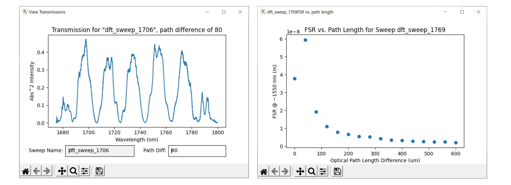
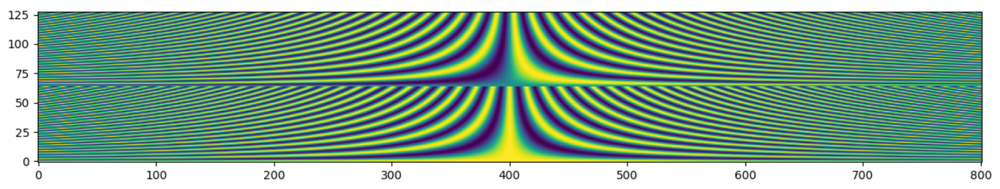
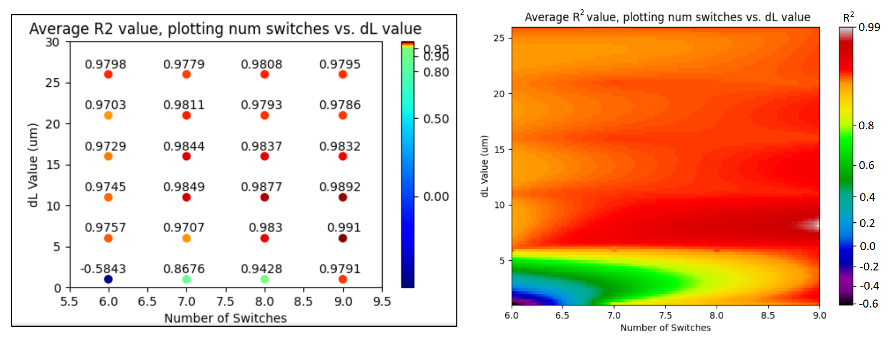

# Computational dFT in Lumerical & Python

Functions and tools to perform dFT simulations in Lumerical Interconnect & Python. Organized into categories:

1. [Misc. Lumerical Scripts](#misclumericalscripts): a few scripts to automate Lumerical design changes

2. [dFT Sweep 1](#dftsweep1): idealized dFT simulation

3. [dFT Sweep 2](#dftsweep2): dFT simulation with frequency-dependent shifters & adiabatic couplers

4. [Reconstruction](#reconstruction): spectrum reconstruction via Elastic-D1

5. [Theoretical dFT](#theoreticaldft): mathematical calculations to investigate design optimization against noise

6. [Tracking Progress](#trackingprogress): notes and presentations relevant to all the above 

   


## Misc. Lumerical Scripts <a name="misclumericalscripts"></a>

A few scripts to automate Lumerical design changes. These are particularly useful when operating on a new computer or working with a new Interconnect design. These scripts must be run in the directory containing the Interconnect file. 

#### Change components directory

*change_component_dir.py* automates changing the "ldf filename" and "s parameters filename" references in all components of a simulation file (including within compound elements). Particularly useful for when running simulations on a new computer. 

Running *change_component_dir.py* assumes that all "load from file" properties should be set to "true". See below  "Change property for all" to change all "load from file" properties to false.

*change_component_dir.lsf* is an identical version written in Lumerical scripting language that can be run in Lumerical.

#### Change property for all

*change_property_all.py* automates changing a certain property for all components of a specific type in a project file. For example, setting

```
simulation_file = "simulation_dfts_basic.icp"
component_type = "WGD"
prop = "load from file"
setting = 0
```
at the top of *change_property_all.py* changes all waveguides (WGD) in *simulation_dfts_basic.icp* to have the "load from file" property set to false. This script can be run when working with a new design. 

*change_property_all.lsf* is an identical version written in Lumerical scripting language.

## dFT Sweep 1 <a name="dftsweep1"></a>

Sweep the 2^j permutations of a dFT chip where phase shifting is not frequency dependent. See **dFT Sweep 2** for frequency-dependent phase shifting that allows simulation of adiabatic couplers. Use **dFT Sweep 1** if the phase shifters in the simulation are Optical Modulator (OM) components, as opposed to Phase Shifter (PHS) components.

#### Steps: 
##### 1. Edit *switch_table.csv* to define the switch character according to the dFT chip design in Interconnect.
Editing *switch_table.csv* specifies the properties/components that must change for each switch state to run the complete parameter sweep. Example for the original 10-switch dFT design below:


*Column A* should be named according to the component name in the Root Element (it will be concatenated, for ex. for *Row 2*, it will be referenced via "::Root Element::Switching_block_1"). 

*Column B* are the properties of the components in *Column A* to be modified to define the first state (*Column C*) and the second state (*Column D*). There can be more states (e.g. continuing into columns E, F, G, etc.), and each state may depend on any number of properties greater than 0. However, list size should be consistent across each row. See valid example "weird" table below:


Note that indexing begins in row 2 in the code; don't delete the header row 1.

##### 2. Set the proper file references in the python sweep file *run_dft_sweep.py* in lines 8-10. 

*simulation_file* refers to the .icp Interconnect project filename
*switch_table_file* refers to the .csv switch table filename
*pickle_file* refers to where the results of the parameter sweep will be stored (.pickle file extension, see [Pickle](https://wiki.python.org/moin/UsingPickle))

##### 3. Set lines 12-14 in *run_dft_sweep.py* (and if necessary*, edit the *calculatePathLengths()* function) to properly calculate path differences for each state. 

*_The present lines 12-14 and calculatePathLengths() function are for the standard Mach-Zehnder interferometer design, where each switch has two states. If a completely new design e.g. three-state switches is developed, calculatePathLengths() will need to be edited._

For the standard MZI design, in lines 12-14 in *run_dft_sweep.py*:


* *switch_paths* lists the paths of each switch in the order of switches in *Column A* in *switch_table.csv*. Within each sub-list of paths, the paths are listed in the order of [dL up, dL down].
  
* The array elements of *top_path* and *bottom_path* refer to the indices of *switch_paths*, as well as the other lists defined in calculatePathLengths() such as *switch_type*, *indicator*, and *indicator_not* (may need to be edited in-function, or brought out).

* For example, if we have deleted Switching_block_5 and Switching_block_10 to run an eight-switch dFT, *top_path* and *bottom_path* can each be shortened; *switch_paths* will stay the same.
```
top_path = [0, 1, 2, 3]
bottom_path = [5, 6, 7, 8]
```

##### 4. Add or delete from the *results_dict* variable in line 17 if needed.

Currently collecting the transmission, FSR_mean (averaged FSR), and FSR_middle (FSR @ 1550 nm) values of each switch configuration.

##### 5. Run *run_dft_sweep.py*, and Lumerical will open and conduct the parameter sweep.

There will be a crude run-time estimate printed to terminal (the number of configurations times the time for one run). Typically, the time estimate underestimates by ~0.75 since other code is running, but it seems to vary.

When the run finishes, the results will be pickled into the location specified by *pickle_file*, which may be loaded into Python again in the future for analysis. 

##### 6. Run *run_sweep_analysis.py* to create a few analysis plots using the pickled files. 

Make sure that *pickle_file* is properly referenced in line 5. 
* Figure 1: FSR vs. path difference
* Figure 2: Transmission spectrum of a specific configuration (index can be edited in line 27). 
* Figure ...

## dFT Sweep 2 <a name="dftsweep2"></a>

Sweep the 2^j permutations of a dFT chip where phase shifting is frequency dependent (phase shifters in simulation are PHS components rather than OM components). Phase shifter measurement files are created in the sweep, and the *.csv* switch table file is formatted slightly differently as compared to **dFT Sweep 1**. Furthermore, since phase shifters are centered around a particular frequency (with perfect phase shifting), **dFT Sweep 2** includes an additional sweep *layer* that iterates over different center frequencies as indicated by the script parameter *num_segments* (the number of segments to split the bandwidth over, as indicated by each segment's center wavelength).

#### Steps:

##### 1. Refer to **dFT Sweep 1** for main details about *switch_table.csv*. Main differences:
* We must change the property of the Phase Shifter (PHS) *within* each switch. The property of the phase shifter to change is called "measurement filename," and to access within the phase shifter, we use Lumerical's double colon (::) notation. An example is in the screenshot below. 
* To indicate the setting of each phase shifter, we input "pi2" for a pi/2 shift, "pi" for a pi shift, and "3pi2" for a 3pi/2 shift in the state columns. 


##### 2. Set the *run_dft_sweep.py* script parameters.

In addition to *simulation_file*, *switch_table_file*, and *pickle_file*, also set:
* *ONA_name*: the name of the ONA component, usually "ONA_1".
* *num_points*: the number of points sampled across all frequencies, which will determine reconstruction resolution, a.k.a the width of the characterization matrix.
* *min_wavelength* and *max_wavelength*: the bounds of the frequencies detected (in nanometers).
* *num_segments*: the number of segments to split the full bandwidth over, where each segment is denoted by its center wavelength.
* *phase_shifts*: a length 2 by *x* list that defines the phase shift as referenced by switch_table_file, where *x* is the number of different states that a phase shifter takes. The first list is the string to be referenced from switch_table_file, and the second list is the phase shift in radians associated with the string. 

##### 3. Set *top_path*, *bottom_path*, *dL*, *switch_paths*, and the parameters in *calculatePathLengths()* to calculate path lengths according to each state. 

A bit different than the parameters found in **dFT Sweep 1**, but overall the same. Overall, *calculatePathLengths()* is not necessary, since the order of transmissions in the characterization matrix does not matter for reconstruction. However, *calculatePathLengths()* is necessary for visualizations: to display FSR vs. OPD, to show the transmissions according to OPD, and to display a full, ordered characterization matrix.

##### 4. *results_dict* should include similar variables as in **dFT Sweep 1**.

##### 5. Run *run_dft_sweep.py*, a simulation time estimate will be printed and the results will be pickled into a folder "stored" that will be referenced in future calculations/analyses.

#### Analysis

Run *run_sweep_analysis_2.py* to view:

* A GUI to view all the transmissions, according to the window segment (indicated by the center wavelength) and the OPD value. Center wavelengths and OPDs can be entered manually, or the up/down and left/right keys can toggle through automatically. 
* A plot of FSR vs. OPD for each window segment. FSR is calculated with Interconnect's software, and generally FSR should decrease with OPD. 



*run_sweep_analysis_2.py* may need to be edited since the dictionary keys may not be named the exact same way in a new simulation.

## Reconstruction <a name="reconstruction"></a>

The Elastic-D1 algorithm is included in this repo for completeness. Post-dFT Sweep, the stored pickle files can be used to create the design's characterization matrix, which can then be used for reconstruction. The reconstruction folder includes sample source spectra, as well as the Elastic-D1 algorithm code in *elastic-D1_simulation.py*. 

*models.py* contain the other reconstruction smoothing models referenced in Derek Kita's paper. 

All of the experimental data can be found in "measurements/" and "Narrowband_2laser_data/". 

## Theoretical dFT <a name="theoreticaldft"></a>

Theoretical dFT was developed to investigate design optimization against experimental noise. 

Instead of creating the characterization matrix in Lumerical, we assume no waveguide loss and perfect phase shifting, and derive the transmission of each OPD to be 1+cos(2πL/λ) where L is the OPD times the waveguide refractive index and λ is the wavelength of light. Characterization matrix calculation time goes from 30+ min to ~5 seconds (even more important as the matrix becomes larger for broadband applications). We can then perform brute-force optimizations to inform on optimal designs, before following with Lumerical simulations. 




#### Python Scripts: 

***create_A_matrix.py:*** Calculates a theoretical A matrix according to select parameters, contains functions _createA()_ and *fast_createA()*. A matrices include the sine (shifted) transmission counterpart. *createA()* calculates via a full derivation (may be useful if incorporating the quasi-orthogonal transmissions), whereas *fast_createA()* calculates via a simplified derivation. Use *fast_createA()* for most applications (for transmissions defined by 1+cos(2πL/λ)), which is for the typical MZI design. 

***create_broadband.py:*** Creates a theoretical broadband spectrum spanning 500 nm (or any amount) using data from the [Quantitative Infrared Database](https://webbook.nist.gov/chemistry/quant-ir/) from The National Institute of Standards and Technology (NIST). Calling *broadSpectrum()* returns a select combination of spectra, while *broadSpectrumGauss()* returns the select combination of spectra plus an additional Gaussian hump. The implementation can be found in *elastic-D1_grid_search_broadband.py*. 

***NOTE: *elastic-D1_grid_search_broadband.py* currently does not run efficiently; the Elastic-D1 algorithm takes too long to calculate 0.025 nm resolution on 500 nm bandwidth (20,000 points). One reconstruction by Elastic-D1 on 20,000 points takes ~55 hours. This is a problem to look into.

***elastic-D1_for_one.py:*** Performs a single Elastic-D1 reconstruction using a theoretical characterization matrix according to the design's number of switches, dL value, desired resolution, and bandwidth. 

***elastic-D1_grid_search.py:*** Performs a grid search optimization using theoretical characterization matrices. The search calculates Elastic-D1 reconstruction accuracy via R<sup>2</sup> for a range of dL values and number of switches (though more parameters may be included). Results of the grid search are stored in a pickle file. 

***visualize_comp.py:*** Visualizes the results of the grid search. *pickle_file* must be assigned to the correct pickle file to read, and *pickle.load(f)* must load variables in the same order as it was dumped in *elastic-D1_grid_search.py*. Colormap linear interpolation, text labeling, and other features can be included or excluded via code commenting. 

***show_coverage.py:*** Visualizes the spread of OPD values for a particular theoretical characterization matrix. The red and green lines indicate the OPDs associated with the guessed bounds on OPD value. Red indicates the OPD where its FSR spans two times the full bandwidth, whereas green indicates the OPD where its FSR is four times the desired resolution (four, so that the wavelengths can sample the max/mins of both the cosine and sine transmission counterparts). 

## Tracking Progress <a name="trackingprogress"></a>

*Joshua_Chen_REU_MRL_Poster.pdf* is the final REU poster, *Tracking Work.pptx* is a running presentation with my thought processes/results/extra data and visualizations. 


### Support

You can email Joshua Chen at joshua.l.chen@gmail.com for help/questions.
